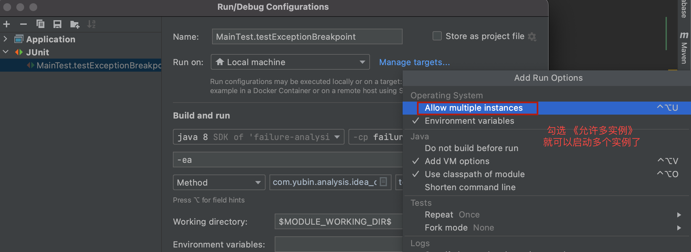

# 1、生产故障分级规范概要

## 1.1、故障等级定义

故障等级定义，不同的业务形态，不同的公司团队，有不一样的划分标准，下表列举了一般常见的维度和标准。

| 线上故障等级     | 标准                                       | 是否回滚 |
| ---------- | ---------------------------------------- | ---- |
| 【P0】致命问题   | 安全：影响线上核心数据安全（核心数据丢失、泄漏）<br />功能：造成系统崩溃、死机，主要功能或重要功能完全不能正常使用；<br />资损：造成资损超过5W；<br />体验：有效客诉>30人或客诉>50人；由于系统问题导致不能开展业务的核心企业，超过3家；<br />影响范围：针对P0/P1/P2/P3系统 | 是    |
| 【P1】严重问题   | 安全：影响线上部分数据安全（丢失、泄漏）<br />功能：主要功能部分丧失或次要功能大部分丧失，或严重错误的提示信息；<br />资损：造成资损超过>1W；<br />体验：有效客诉>5人；由于系统问题导致不能开展业务的核心企业，超过1家；<br />影响范围：针对P0/P1/P2/P3系统 | 是    |
| 【P2】一般问题   | 功能：次要功能部分丧、边界校验不全等；<br />资损：造成资损超过>1k；<br />体验：用户界面交互差或操作等待时间长；<br />影响范围：针对P0/P1/P2/P3系统 | 否    |
| 【P3】轻微问题   | 功能：界面提示描述错别字、排版问题等用户提示性问题，但不影响执行工作功能或重要功能。 | 否    |
| **线上故障分类** | **说明**                                   |      |
| 外部依赖类      | 是由所依赖的上下游系统的缺陷或不稳定直接导致业务流程受阻，用户体验客诉事故。   |      |
| 运营质量类      | 由运营或业务人员在进行销售活动创建或线上策略配置错误等导致的一些问题。      |      |
| 需求质量类      | 由于产品方案设计存在逻辑或流程上缺陷直接导致的线上问题。             |      |
| 系统质量类      | 系统存在逻辑或流程缺陷直接导致线上问题，同时还包括性能、稳定性引发的问题。    |      |

【1】核心数据定义

**个人敏感信息：**姓名、出生日期、身份证号码、个人生物识别信息、住址、通信通讯联系方式、通信记录和内容、账号密码、财产信息、征信信息、行踪轨迹、住宿信息、健康生理信息等。

**用户画像：**职业、经济、健康、教育、个人喜好、信用、行为等。

【2】系统级别定义

**零级系统（P0）：**为公司核心业务服务的核心系统，一旦发生不可用会直接影响公司核心业务的业务连续性，对所有系统用户造成影响。

**一级系统（P1）：**重点的业务系统，一旦发生不可用，影响核心业务系统的连续性，并造成大部分内部用户或外部用户不可使用此系统。

**二级系统（P2）：**重要的业务系统，一旦发生不可用存在一定的业务可用性问题，但不会影响核心业务的业务连续性。

**三级系统（P3）：**非核心的支撑系统，一旦发生故障不直接产生业务影响，但会影响少部分内部用户使用此系统。

【3】影响范围与故障等级

| 系统分级     | 故障时长\受影响用户 | 全部用户 | 大部分用户（超过20%） | 少量用户 |
| -------- | ---------- | ---- | ------------ | ---- |
| 零级系统（P0） | 超过60分钟     | P0   | P0           | P1   |
|          | 超过30分钟     | P0   | P1           | P2   |
|          | 超过10分钟     | P1   | P1           | P2   |
|          | 10分钟以内     | P2   | P2           | P2   |
| 一级系统（P1） | 超过60分钟     | P0   | P1           | P1   |
|          | 超过30分钟     | P1   | P1           | P2   |
|          | 超过10分钟     | P1   | P2           | P2   |
|          | 10分钟以内     | P2   | P2           | N/A  |
| 二级系统（P2） | 超过60分钟     | P1   | P1           | P2   |
|          | 超过30分钟     | P2   | P2           | P2   |
|          | 超过10分钟     | P2   | P2           | P2   |
|          | 10分钟以内     | N/A  | N/A          | N/A  |
| 三级系统（P3） | 超过60分钟     | P1   | P2           | P2   |
|          | 超过30分钟     | P2   | P2           | N/A  |
|          | 超过10分钟     | N/A  | N/A          | N/A  |
|          | 10分钟以内     | N/A  | N/A          | N/A  |

## 1.2、故障报告模板示例

模板参考

| 故障分析报告       |                |                                          |        |
| ------------ | -------------- | ---------------------------------------- | ------ |
| 故障编号         |                | 服务不可用时间                                  |        |
| 故障开始时间       |                | 故障结束时间                                   |        |
| 故障类型         |                | 责任组（造成该故障的主要责任团队）                        |        |
| **一、问题回顾**   |                |                                          |        |
| 故障概括         | 概要描述           | 对事故进行概要描述，写清楚<br />何时？<br />何系统？<br />因何原因？<br />发生什么故障？<br />总统影响是什么？（影响用户，服务拒绝还是功能错误？） |        |
|              | 问题经过           | 补充故障的完整时间线，方便回溯内容，以时间顺序相信描述故障<br />发生（诱发）、发展（扩散、隔离）、<br />发现（测试、监控、内部反馈、用户反馈和客诉）、<br />处理（止损）过程及期间系统的表现，<br />重点关注诱发原因、扩散条件、止损动作、止损效果等关键要素，<br />每句以时间开头，每个关键节点单独写一行 |        |
|              | 问题原因           | 描述故障根本原因，以及此原因导致故障发生的逻辑。                 |        |
|              | 故障影响及损失        | 详细描述故障对业务造成的影响以及具体的损失数据，格式：<br />1、故障影响范围及程度说明<br />2、损失量情况<br />损失数据包括：流量损失、收入损失、流水损失、损失占当天的比例。 |        |
| **二、后续改进措施** |                |                                          |        |
| 序号           | 管理措施+技术措施+产品功能 | 负责人                                      | 期望完成时间 |
| 1            |                |                                          |        |
| 2            |                |                                          |        |
| 3            |                |                                          |        |

## 1.3、故障响应处理机制


如图所示，大体描述了一般生产故障的处理机制

故障发现：

1-客户投诉或者业务反馈，研发自我发现

2-监控报警：技术监控，业务监控

## 1.4、思考

- 为什么会发生这个问题？
- 为什么测试阶段没有发现？
- 为什么系统不能容错？
- 能不能更早发现问题？
- 解决过程能不能更快？
- 怎样防止类似的事情发生？

# 2、生产故障原因和分类

## 2.1、故障分类

- 代码bug：上线代码逻辑有问题，遇到特殊情况下，导致故障的情况。
- 操作不当：线上配置或资源配置错误，操作不当，比如启动顺序不合理，初始化脚本不对，语法生产数据隔离混用等。
- 系统级别软件bug：技术架构中使用到的任何OS，第三方类库，软件在特殊场景下，bug被触发导致故障的情况。
- 突发流量：热点或突发事件，引发的瞬时流量超过日常峰值或成倍增长，造成性能下降或功能不可用问题。
- 资源使用不均：整体产品线利用率不达标，但有些业务冗余度不足，导致资源不能正确合理使用。
- 容量预估不足：对个别业务核心池预估不足。
- 网络类：公网拥堵、丢包、专线、网络设备故障、ip被攻击（包括DNS被攻击）、IP被封、域名被封、网络软件bug、业务部门使用不当、未及时扩容等。
- 安全类：被攻击，漏洞被利用等问题，均归为此类。
- 局方故障：ISP，根域名服务，电力，空调，光缆等外部单位故障导致的问题。
- 硬件故障：任何硬件非人为原因损坏导致故障均归类为此类。
- 第三方合作公司或接口故障：项目依赖的第三方公司或接口故障。


实际生产中，遇见的故障所占比例（个人统计，未必准确）

| 故障分类                              | 比例（%） | 示例                                       |
| --------------------------------- | ----- | ---------------------------------------- |
| 配置不当，操作不当                         | 30    | 数据库新增字段，线上忘记添加；配置文件更改未同步，操作不当（设计本身也可能不合理）； |
| 代码bug                             | 50    | 业务考虑不周全，未覆盖所有场景，测试不到位；代码质量或设计问题，各种异常等，包括异常处理； |
| 突发流量+资源问题（包括使用不当，也包括软件特性原理不够深入理解） | 10    | 跟场景有很大关系；电商等领域的促销流量；内容网站的突发流量等；依赖的存储，网络，等自身波动异常等；慢sql，各种主从不一致等； |
| 第三方合作公司或接口故障                      | 8     | 依赖的接口有故障；微信认证失败等等                        |
| 其它                                | 2     | 硬件故障等等                                   |

# 3、生产故障定位和解决流程

## 3.1、影响服务质量的因素

我们常常面对如下的业务场景

- 大量无用业务逻辑
- sleep
- 循环里面写查询
- 磁盘满了影响到有磁盘写操作的接口
- 慢查询的sql
- redis中存在大key，带宽打满不知是哪些接口影响与被影响
- 队列堆积却不知哪些接口影响
- 流量放大系数评估全靠经验和看代码


## 3.2、故障发现

一个高可用的业务系统除了技术架构支撑之外，监控系统作为事中决策支持和事后决策止损是必不可少的一部分

### 3.2.1、监控体系汇总

监控体系分类一般可分为：业务监控，系统级别监控，网络监控，程序代码监控，日志监控，用户行为分析监控，其它种类监控等

## 3.3、一般架构图


# 4、线上排查故障

## 4.1、故障排除一般需要掌握的技能-工具篇

**idea允许程序多实例运行配置**



- 一般情况下，需要了解业务场景，千万不要第一时间着急解决bug，应先评断是否可以回滚，影响面大小，是否为上层提供服务，是否有数据异常。
- 应熟悉项目依赖的监控，学会看监控。
- 应熟悉开发环境的断点排查与诊断，熟悉git、maven、idea的使用，分析如何复现线上故障。
- 线上排查故障的工具链（仅供参考）

### 4.1.1、idea断点

#### 4.1.1.1、断点类型与配置

##### 1、行断点(line breakpoints)

在到达设置断点的代码行时暂停程序。这种类型的断点可以设置在任何可执行的代码行上。


##### 2、字段断点（field breakpoints）

当指定的字段被读取或写入时暂停程序。这允许你对与特定实例变量的交互作出反应。例如，如果在一个复杂的过程结束时，你的某个字段出现了明显的错误值，设置一个字段观察点可能有助于确定故障的来源。


鼠标右键点击断点图标，弹出该断点配置，会有Field access和Field modification选项，此选项是字段类型断点特有的，分别对应访问该字段或修改该字段触发断点，两项同时选中，则访问与修改该字段都会触发断点。


##### 3、方法断点（Method breakpoints）

在进入或退出指定方法或其实现之一时暂停程序，允许你检查方法的进入/退出条件。

当断点加在class类名这一行，且该类中没有编写构造函数（只有默认无参构造函数），当调用默认无参构造函数时会触发此断点，程序挂起。


鼠标右键点击该断点图标，弹出该断点配置，会有Emulated、Method entry、Method exit选项，此选项是方法类型断点特有的。Emulated勾选中，会将方法断点优化成方法中第一条和最后一条语句的行断点，这样会优化调试的性能，因此idea会默认选中。

通过匹配符批量添加方法断点在断点列表页


**匹配符示例：**

| Class   | Method | Result                    |
| ------- | ------ | ------------------------- |
| *       | print  | 匹配所有类的print()方法           |
| Printer | *      | 匹配Printer类的所有方法           |
| Printer | set*   | 匹配Printer类的所有方法名为set开头的方法 |

##### 4、异常断点

异常断点：Exception breakpoints

异常断点分为两种，一种是Any Exception，任意Throwable异常被捕获或未被捕获就会触发断点，另一种是指定类型的异常及指定异常的子类被捕获或未被捕获会触发断点。

鼠标右键点击该断点图标，弹出该断点配置，会有Caught exception和Uncaught exception选项，此选项是异常类型断点特有的，Caught exception选项选中时，当指定的异常被捕获时，触发断点程序挂起，Uncaught exception选中时，当指定的异常被捕获时，触发断点程序挂起。


#### 4.1.1.2、断点控制

##### 1、断点删除

- 所有类型断点：断点设置中移除对应的即可。
- 快捷移除：行位置鼠标左键单击即可移除（异常断点除外）。

建议：为了避免意外删除断点并丢失其参数，通常选择点击鼠标中键来删除断点。


# 5、线上故障案例分析

## 5.1、redis锁处理幂等性失效

```java
@Transactional(rollbackFor = Exception.class)
public void add(User user) {
    log.info("add user params user:{}", JSON.toJSONString(user));
    // 获取锁
    redisLock.lock("key");
    try {
        long count = userDao.select("身份证号");
        if (count == 0) {
            // 插入该条数据
        }
    } catch (Exception e) {
        e.printStackTrace();
    } finally {
        redisLock.unlock("key");
    }
}
```

此段代码的初衷是为了保证在并发请求的情况下，同一个身份证号的用户在表中只有一条数据。

但是分析上面这段代码，分布式锁里面的代码是 先查询下有没有数据，没有数据的话则插入一条；咋一看挺正确的，不过由于mysql的是读已提交的数据，如果有一个线程释放了锁，但是迟迟不提交事务的话，就会产生不幂等的情况发生。

**扩展：**

事务的传播链路上不能有异常

举个例子：b方法执行的时候抛出异常，事务被标记为回滚状态，但是在a方法中b方法被捕获了，因此dao.insert方法还能执行，但是在执行完成之后准备提交事务的时候呢发现事务已经被标记为回滚了，因此会抛出异常。

```txt
UnexpectedRollbackException: Transaction rolled back because it has been marked as rollback-only
```

```java
@Transactional(rollbackFor = Exception.class)
public void a() {
  try {
    b();
  } catch(Exception e) {
    log.error("b方法执行异常， 事务已经被标记为回滚");
  }
  dao.insert(xxx);
}

@Transactional(rollbackFor = Exception.class)
public void b() {
  dao.update(***);
  int i = 1/0;
}
```

小技巧：

一般在企业开发中，我们不想业务数据被物理删除，通常使用的是逻辑删除，这样有时候就导致了我们的业务唯一字段没法唯一，解决方案：

- 将isactive的 0表示未删除， 其它表示已删除，每次删除都在已有的基础上对这个isactive字段进行加1；
- 或者可以额外增加一个版本号字段来标记删除。


## 5.2、服务间超时处理

在一个很普遍的场景中，涉及到双端通信的情况下，不论是传统的单机服务，还是现在的微服务，甚至是异步通信技术（进程内，进程与进程），一直都存在着三态的问题，即成功，失败，超时。

成功失败具有明确的业务语义和边界，正常处理即可。最复杂的就是超时，因为网络通信原因，双端都不总是确定，到底哪个环节超时（服务端呢？还是客户端呢？）。

### 5.2.1、同步调用超时


超时点：

- 请求超时
- 服务端内部处理超时：比如操作耗时的资源，调用第三方系统等造成客户端请求整体超时而主动断开连接。
- 服务端处理正常，但响应结果阶段超时

**处理方案：**

**客户端：**无论哪个阶段，客户端都不确定请求是否被应答，即服务端处理的结果，客户端不知道是否成功。客户端此时能做的，有两种方法：

- 重试：客户端需要主动做好重试方案，比如类似mq的重试队列（1s、5s、10s、30、1m、2m、3m、4m、5m、6m、7m、8m、9m、10m、20m、30m、1h、2h），主要的技术，spring-retry框架组件，将请求扔到自产自销的mq，依靠mq的重试队列主动重试，或者建立定时任务表重试。  **不管哪种方式，需要服务端接口具备幂等下。**
- 主动查询结果：超时后客户端主动查询，查询的时机类似重试机制，因为快速的查询，并不总是有效，当发生网络抖动的时候，很大概率就地查询，也是网络抖动阶段。

**服务端：**服务端不存在请求超时和响应超时，但存在自身超时的情况，解决方案：

- 自身rt（Reaction Time(响应时间)的意思）值需要优化，比如慢sql等
- 依赖三方接口的时候，跟第三方接口又形成了一个客户端-服务端模式，根据具体场景或者快速失败，或者做好容错措施，必要的时候，还会有比如金融领域的冲正操作。

### 5.2.2、异步调用超时

异步调用，类似ajax，客户端同步请求，服务端异步响应


超时点：

- 请求超时
- 服务端内部处理超时：比如操作耗时的资源，调用第三方系统等造成客户端请求整体超时而主动断开连接。
- 服务端处理正常，但响应结果阶段超时
- 异步响应超时

客户端：

参考同步-客户端

服务端：

服务端不存在请求超时和同步响应超时，对于内部处理超时，同同步情况一样。那么就只剩下异步响应超时了。

比较有代表性的就是支付结果通知，可参考：[支付结果通知文档](https://pay.weixin.qq.com/wiki/doc/api/native.php?chapter=9_7&index=8)

存在此问题就是服务端通知客户端的时候（客户端需要同步提高响应服务端结果通知的接口），未接受到客户端的响应。


### 5.2.3、MQ超时


在此处讨论的超时，其实相当于另外一个话题，如何保证mq不丢消息，无论是kafka和RocketMQ，都支持ack的机制，用以确认消息的发送和接受的成功。


